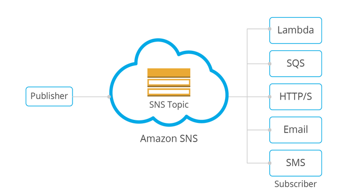

### What is Lambda ?

  - AWS Lambda is an event-driven, serverless Function as a Service provided by Amazon as a part of Amazon Web Services.
It is designed to enable developers to run code without provisioning or managing servers. It executes code in response to
events and automatically manages the computing resources required by that code.

### What is SNS ?

  - Amazon Simple Notification Service is a notification service provided as part of Amazon Web Services since 2010.
It provides a service for sending messages. Amazon SNS acts as a single message bus that can message to a variety of devices and platforms.

### What is SQS ?

  - Amazon Simple Queue Service is a distributed message queuing service introduced by Amazon.com as a beta in late 2004,
and generally available in mid 2006. It supports programmatic sending of messages via web service applications as a way to
communicate over the Internet.

### Architecture of this project....

### Scope :
 A user can deploy code on AWS Lambda without concern for backend servers. The API Gateway facilitates communication between the server and client.
Upon deploying code on Lambda, a notification is sent to SQS via SNS.

