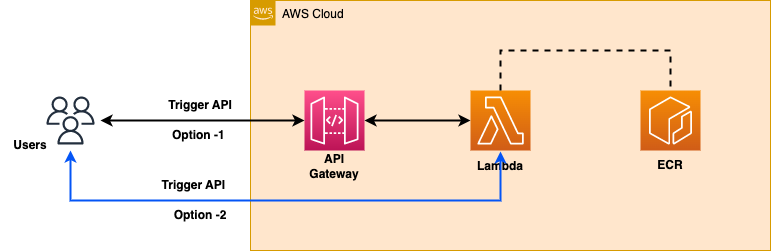

## Project scope :
  - Implement an Elastic Container Registry image on AWS Lambda. To facilitate an additional server-client interaction, I utilized a REST API.

### What is Elastic Container Registery ?
  - Amazon Elastic Container Registry Public is a managed AWS container image registry service that is secure, scalable, and reliable.
Amazon ECR supports public image repositories with resource-based permissions using AWS IAM so that specific users can access your public repositories to push images.
  

### Architecture of this project...

